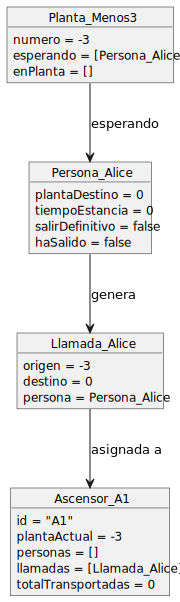
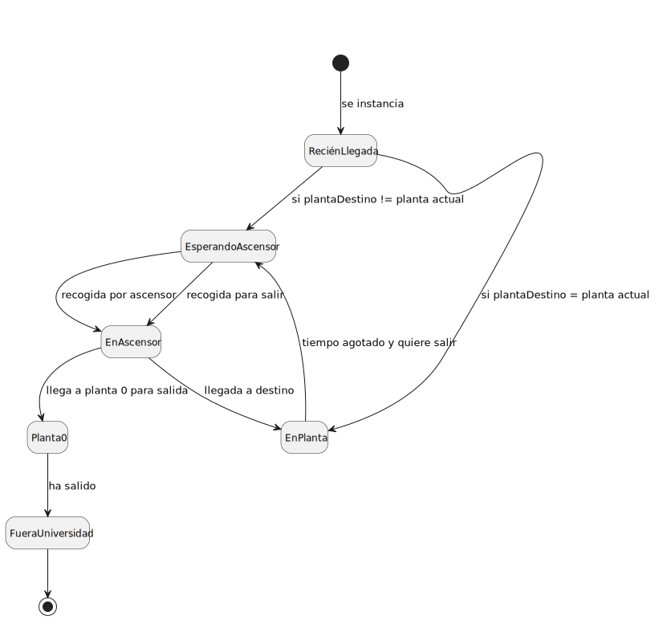

# Proyecto pyAscensores

Este proyecto simula el funcionamiento de ascensores en una universidad, gestionando la llegada de personas, colas de espera, movimientos de ascensores y visualización por consola.

## Estructura de Clases

- **Universidad**: Coordina la generación de llegadas, la gestión de estancias y el control de ascensores.  
- **Planta**: Representa una planta del edificio, con colas de personas esperando (`esperando`) y personas dentro (`enPlanta`).  
- **Persona**: Modelo de usuario con destino, tiempo de estancia y llamadas internas.  
- **Llamada**: Petición de uso de ascensor con origen y referencia a la persona.  
- **Ascensor**: Simula un ascensor con capacidad limitada. Gestiona llamadas, pasajeros y movimiento.  
- **Tiempo**: Reloj de simulación (día, hora, minuto). Avanza el tiempo y valida horas de entrada.  
- **ControlAscensor**: Asigna llamadas a ascensores y desencadena su movimiento.  
- **Mundo** / **Main**: Bucle principal que avanza el tiempo y coordina la simulación.  
- **ConsolaVista**, **LineaVista**, **RepresentadorPlanta**: Clases para mostrar el estado en consola.  

## Modelo del Dominio

### Diagrama de Clases

 [Ver Código ](modelosUML/MdD/DdC/DdC.puml)

### Diagrama de Objetos

 [Ver Código ](modelosUML/MdD/DiagramaObjetos/DiagramaObjetos.puml)

### Diagrama de Estados (Persona)

 [Ver Código ](modelosUML/MdD/DiagramaEstados/DiagramaEstadosPersona.puml)

